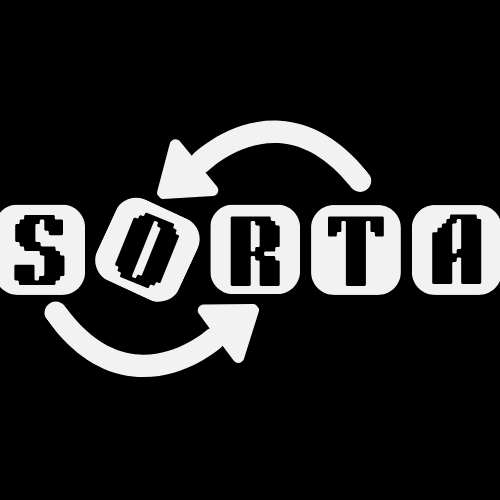

<div align="center">
  
  
  # Sorta
  
  **Visualize sorting alogrithms in Increasing order with step by step animations and explore various techniques using Sorta. This Project was made for the Axiom YSWS**
  
  [](https://github.com/Rexaintreal/Sorta)
  [](https://axiom.hackclub.com/)
  [](https://hackatime-badge.hackclub.com/U09B8FXUS78/Sorta)
  [](https://flask.palletsprojects.com/)
  [](https://developer.mozilla.org/en-US/docs/Web/JavaScript)
  [](https://tailwindcss.com/)
</div>


---

## About

Sorta features a clean minimal UI built with TailwindCSS and smooth sorting animations powered by JavaScript It offers the top six sorting algorithms **Bubble Sort, Insertion Sort, Merge Sort, Quick Sort, Selection Sort, and Heap Sort** with example code in five languages. You can edit the values in the array or list, as well as the length.
Sorta is hosted on PythonAnywhere at [LINK](https://sorta.pythonanywhere.com/) try it and share your feedback! I made this project for [Axiom YSWS](https://axiom.hackclub.com/) a Hack Club YSWS


---

## Demo Video

The Demo video where I show all the sorting visualization

**[DEMO]()**

---

## Try it (ITS LIVE)

Sorta is hosted on PythonAnywhere and you can visit it at [LINK](https://sorta.pythonanywhere.com/)

## Features
- Clean minimal UI
- Six sorting algorithms with visuals
- Example code in five languages
- Smooth step by step animations
- Editable array values and length

---

## Project Structure

```
Sorta/           
├── static/               
│   ├── assets/          # Logo files and favicon
│   ├── css/             # global style
│   └── js/              # animation and other logic
├── templates/           # HTML templates for all the pages
├── .gitignore           # Git ignore file
├── app.py               # Main Flask application with all routes
├── LICENSE              # MIT License
├── README.md            # You are reading this hehe
└── requirements.txt     # Python dependencies (only Flask)
```

---

## Setup and Installation

### Prerequisites
- **Python 3.13+** (I used 3.13.5 but anything 3.13+ should work)
- **pip** for installing packages

### Installation Steps

1. **Clone the repository:**
   ```bash
   git clone https://github.com/Rexaintreal/Sorta.git
   cd Sorta
   ```

2. **Create a virtual environment (recommended):**
   
   This keeps things clean and doesn't mess with your other Python projects (i dont usually do it T_T)
   
   **Windows:**
   ```bash
   python -m venv venv
   .\venv\Scripts\activate
   ```
   
   **macOS / Linux:**
   ```bash
   python3 -m venv venv
   source venv/bin/activate
   ```

3. **Install dependencies:**
   ```bash
   pip install -r requirements.txt
   ```

4. **Run the app:**
   ```bash
   python app.py
   ```

5. **Open it up:**
   
   Go to `http://127.0.0.1:5000` in your browser

---
## Technical Details

Sorta’s sorting visualizations are built with a lightweight stack and run fully on the client side (the browser)
-**HTML + TailwindCSS** for the layout, UI, and responsive design
-**Vanilla JavaScript** for generating steps handling animations and controlling play/pause/step logic
-**requestAnimationFrame** for smooth frame-based animations during swaps comparisons and transitions
-**DOM rendering** to rebuild and update the array boxes highlights and sorted states
-**Flask** is used only for routing the pages and there is no heavy backend logic or database

All sorting steps (compare swap no swap sorted complete) are created in JavaScript and saved in a array Then the animator just reads each step one by one and updates the screen in real time Every sorting algorithm follows the same pattern

---

## License

MIT [LICENSE](LICENSE).

---

## Acknowledgements

- **The Internet**
- [**GeeksforGeeks**](https://www.geeksforgeeks.org/) — for multi-language example code used as reference  

---

## You may also like...

Some other projects I've built:

- [Ziks](https://github.com/Rexaintreal/Ziks) - A physics simulator with 21 Simulatons made using vanilla JS
- [Eureka](https://github.com/Rexaintreal/Eureka) - A website where you can find local spots near you which don't show up on Google Maps or any other apps
- [DawnDuck](https://github.com/Rexaintreal/DawnDuck) - USB HID Automation Tool for Morning Routines
- [Lynx](https://github.com/Rexaintreal/lynx) - OpenCV Image Manipulation WebApp
- [Libro Voice](https://github.com/Rexaintreal/Libro-Voice) - PDF to Audio Converter
- [Snippet Vision](https://github.com/Rexaintreal/Snippet-Vision) - YouTube Video Summarizer
- [Weather App](https://github.com/Rexaintreal/WeatherApp) - Python Weather Forecast App
- [Python Screenrecorder](https://github.com/Rexaintreal/PythonScreenrecorder) - Python Screen Recorder
- [Typing Speed Tester](https://github.com/Rexaintreal/TypingSpeedTester) - Python Typing Speed Tester
- [Movie Recommender](https://github.com/Rexaintreal/Movie-Recommender) - Python Movie Recommender
- [Password Generator](https://github.com/Rexaintreal/Password-Generator) - Python Password Generator
- [Object Tales](https://github.com/Rexaintreal/Object-Tales) - Python Image to Story Generator
- [Finance Manager](https://github.com/Rexaintreal/Finance-Manager) - Flask WebApp to Monitor Savings
- [Codegram](https://github.com/Rexaintreal/Codegram) - Social Media for Coders
- [Simple Flask Notes](https://github.com/Rexaintreal/Simple-Flask-Notes) - Flask Notes App
- [Key5](https://github.com/Rexaintreal/key5) - Python Keylogger
- [Codegram2024](https://github.com/Rexaintreal/Codegram2024) - Modern Codegram Update
- [Cupid](https://github.com/Rexaintreal/cupid) - Dating Web App for Teenagers
- [Gym Vogue](https://github.com/Rexaintreal/GymVogue/) - Ecommerce for Gym Freaks
- [Confessions](https://github.com/Rexaintreal/Confessions) - Anonymous Confession Platform
- [Syna](https://github.com/Rexaintreal/syna) - Social Music App with Spotify
- [Apollo](https://github.com/Rexaintreal/Apollo) - Minimal Music Player with Dancing Cat
- [Eros](https://github.com/Rexaintreal/Eros) - Face Symmetry Analyzer
- [Notez](https://github.com/Rexaintreal/Notez) - Clean Android Notes App

---

## Author

Built by **Saurabh Tiwari**

- Portfolio: [saurabhcodesawfully.pythonanywhere.com](https://saurabhcodesawfully.pythonanywhere.com/)
- Email: [saurabhtiwari7986@gmail.com](mailto:saurabhtiwari7986@gmail.com)  
- Twitter: [@Saurabhcodes01](https://x.com/Saurabhcodes01)
- Instagram: [@saurabhcodesawfully](https://instagram.com/saurabhcodesawfully)
